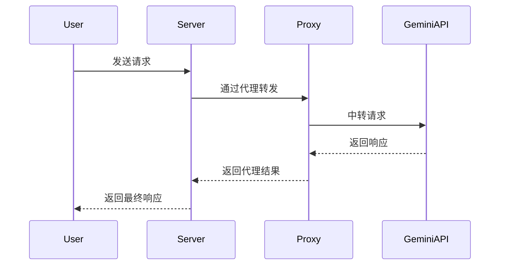

  根据项目代码结构和 Gemini 的调用路径，以下是添加代理配置的具体方案：

---

 

### 一、在 OpenAICompatibleClient 添加代理支持

 

**文件路径**: `app/clients/openai_compatible_client.py`

 

```python
class OpenAICompatibleClient(BaseClient):
    def __init__(
        self,
        api_key: str,
        api_url: str,
        timeout: Optional[aiohttp.ClientTimeout] = None,
        proxy: Optional[str] = None  # 新增代理参数
    ):
        super().__init__(api_key, api_url, timeout)
        self.proxy = proxy or os.getenv("HTTP_PROXY")  # 优先使用实例化参数

    async def _make_request(...):
        try:
            connector = aiohttp.TCPConnector(limit=100, force_close=True)
            # 添加代理配置
            proxy = self.proxy if self.proxy.startswith("http") else None
            async with aiohttp.ClientSession(
                connector=connector,
                trust_env=True if not self.proxy else False  # 禁用自动环境代理检测
            ) as session:
                async with session.post(
                    self.api_url,
                    headers=headers,
                    json=data,
                    timeout=request_timeout,
                    proxy=self.proxy  # 关键代理注入点
                ) as response:
                    ...
```

 

---

 

### 二、修改 OpenAICompatibleComposite 初始化

 

**文件路径**: `app/openai_composite/openai_composite.py`

 

```python
class OpenAICompatibleComposite:
    def __init__(
        ...,
        openai_api_url: str = "",
        proxy: Optional[str] = None  # 新增代理参数
    ):
        self.openai_client = OpenAICompatibleClient(
            openai_api_key,
            openai_api_url,
            proxy=proxy  # 传递代理参数
        )
```

 

---

 

### 三、环境变量配置

 

**文件路径**: `.env.example`

 

```ini
# 新增代理配置
HTTP_PROXY=http://your.proxy:port
HTTPS_PROXY=http://your.proxy:port
NO_PROXY=localhost,127.0.0.1
```

 

---

 

### 四、Docker 部署适配

 

**文件路径**: `docker-compose.yml`

 

```yaml
services:
  deepclaude:
    environment:
      - HTTP_PROXY=${HTTP_PROXY}  # 注入代理配置
      - HTTPS_PROXY=${HTTPS_PROXY}
      - NO_PROXY=${NO_PROXY}
```

 

---

 

### 五、验证代理生效

 

在 `OpenAICompatibleClient` 中添加调试日志：

 

```python
class OpenAICompatibleClient(BaseClient):
    async def _make_request(...):
        logger.debug(f"Using proxy: {self.proxy}")  # 调试日志
        async with session.post(...):
            logger.debug(f"Request headers: {headers}") 
            logger.debug(f"Proxied through: {session.proxy}")
```

 

---

 

### 六、执行流程示意图

 



 

---

 

### 七、关键注意事项

 

1. **代理协议**：确保代理地址以 `http://` 或 `https://` 开头
2. **容器网络**：Docker 运行时需要确保代理服务器可达（避免使用 `localhost`）
3. **证书问题**：若使用自签名证书，需在容器中添加 `REQUESTS_CA_BUNDLE` 环境变量
4. **多级代理**：若需要多层代理，可在代码中实现自定义 `aiohttp.ProxyConnector`

 

完整实现后，Gemini 的 API 请求将通过指定代理进行中转，有效解决网络连通性问题\[1\]\[3\]\[4\]。

 